# 🔍 Lucid — AI Image Recognition

A modern, responsive React 19 + Vite dashboard for uploading images and browsing AI recognition results — including detected objects, detected text, confidence scores, recognition grade, and AI-generated audio summaries.

---

## 📋 Project Overview

Lucid is a fully serverless AWS application with a React 19 frontend built on Vite. Users upload images directly from the browser (including via the rear camera on mobile), which are processed by an event-driven AWS Lambda pipeline. Amazon Rekognition detects objects and text in the image; a natural-language text summary is generated programmatically and then converted to an MP3 audio file by Amazon Polly. All metadata — objects, categories, detected text, summary, audio file reference, and recognition grade — is stored in Amazon DynamoDB. The dashboard fetches and displays all results, with pre-signed URLs for both images and audio files.

---

## ✨ Key Features

- **Direct browser-to-S3 upload** — via a pre-signed PUT URL; no binary data passes through API Gateway; upload progress reported via `XMLHttpRequest`
- **Mobile rear camera support** — file input uses `capture="environment"` to open the rear camera on mobile devices
- **Object detection** — Rekognition `detect_labels` (up to 20 labels, ≥80% confidence) with bounding boxes, instance counts, and category grouping
- **Text detection** — Rekognition `detect_text` extracts readable text lines from the image
- **AI audio summary** — a natural-language text summary is synthesised to MP3 by Amazon Polly and stored in S3
- **Recognition grade** — five-tier star rating based on average label confidence (★★ Low to ★★★★★ Excellent)
- **Image gallery** — lazy-loaded (`loading="lazy"`), memoized cards sorted by recency
- **Image detail modal** — tabbed view for Objects, Text, Summary, and Audio playback
- **Light / Dark theme** — preference persisted to `localStorage`; respects OS preference on first visit
- **Pre-signed URL expiry** — image and audio URLs expire after 1 hour; auto-refreshed on next API call

---

## ☁️ AWS Services Used

| Service | Role |
|---|---|
| **Amazon S3** (×2) | One bucket for static website hosting; one bucket for image storage and audio summaries |
| **Amazon API Gateway** | HTTP API exposing `/upload-url` (POST), `/images` (GET), `/image/{id}` (GET) |
| **AWS Lambda** (×3) | `generate_upload_url` — pre-signed URL generator; `image_processor` — S3-triggered processing pipeline; `image_dashboard_api` — dashboard data API |
| **Amazon Rekognition** | `detect_labels` (object detection with bounding boxes) and `detect_text` (text extraction) |
| **Amazon Polly** | `synthesize_speech` — converts text summary to MP3 audio |
| **Amazon DynamoDB** | `ImageRecognitionMetadata` table — stores all recognition results and references |
| **Amazon IAM** | IAM roles and policies for Lambda execution permissions |
| **Amazon CloudWatch** | Lambda function logging and monitoring |

---

## 🏗️ System Architecture

```
Browser
   │
   │  POST /upload-url  (extension)
   ▼
Amazon API Gateway ──► generate_upload_url (Lambda)
                              │ returns imageId, objectKey, pre-signed PUT URL
                              ▼
                        Browser PUT image ──► Amazon S3
                                              images/ folder
                                                 │
                                                 │ S3 PUT event trigger
                                                 ▼
                                        image_processor (Lambda)
                                                 │
                                   ┌─────────────┼─────────────┐
                                   │             │             │
                                   ▼             ▼             ▼
                            Rekognition    Rekognition     Amazon Polly
                           detect_labels  detect_text   synthesize_speech
                           (objects,      (text lines)    (MP3 audio)
                            bounding                          │
                            boxes)                            ▼
                                   │                    S3 audio-summary/
                                   │                         │
                                   └──────────┬──────────────┘
                                              ▼
                                       Amazon DynamoDB
                                  ImageRecognitionMetadata

Browser (Gallery/Detail)
   │
   │  GET /images  |  GET /image/{id}
   ▼
Amazon API Gateway ──► image_dashboard_api (Lambda)
                              │
                   ┌──────────┴──────────┐
                   │                     │
                   ▼                     ▼
           Amazon DynamoDB         Amazon S3
            (scan / get_item)   (pre-signed GET URLs
                                 — image + audio)
```

Frontend hosted on:

```
Amazon S3 (hosting bucket) — static website
```

---

## 🔄 Project Workflow

1. The user selects or captures an image in the browser. The frontend calls `POST /upload-url` with the file extension to request a pre-signed S3 PUT URL and a unique `imageId`.
2. The browser uploads the image file directly to the S3 data bucket using `XMLHttpRequest` (to enable upload progress reporting). The image is stored under `images/`.
3. The S3 PUT event triggers the `image_processor` Lambda.
4. `image_processor` calls Rekognition `detect_labels` (max 20 labels, min 80% confidence) and `detect_text` on the uploaded image.
5. Object hierarchy is processed: leaf labels (non-parent labels) are identified, bounding boxes and instance counts extracted, and categories grouped.
6. A natural-language text summary is built from the featured object, instance counts, additional objects, categories, and any detected text.
7. The summary text is sent to Amazon Polly `synthesize_speech` to produce an MP3 file, which is stored in S3 under `audio-summary/`.
8. All metadata (imageId, objectKey, audioKey, objects, categories, detected text, summary, average confidence, recognition grade, model version, timestamp) is written to the DynamoDB `ImageRecognitionMetadata` table.
9. The dashboard frontend fetches `GET /images` to list all records and `GET /image/{id}` for full detail on a single image.
10. `image_dashboard_api` reads DynamoDB and generates pre-signed GET URLs for both the image and the audio file (1-hour expiry).

---

## 📸 Screenshots

### 🏠 Home — Dark Mode

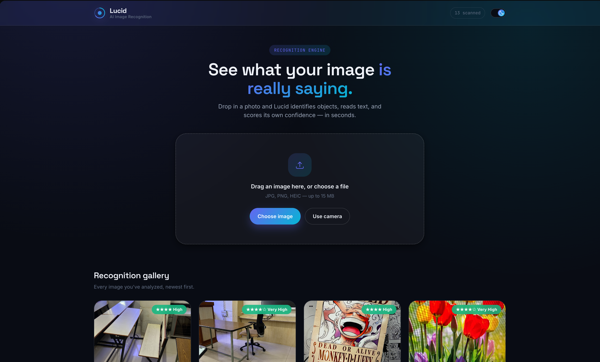

### 🏠 Home — Light Mode

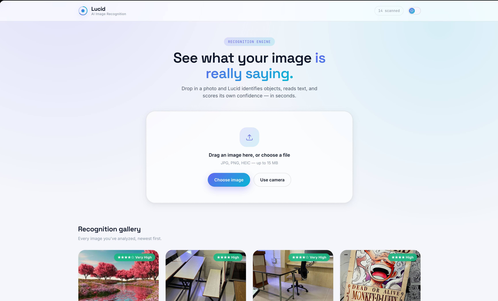

### 📤 Image Upload

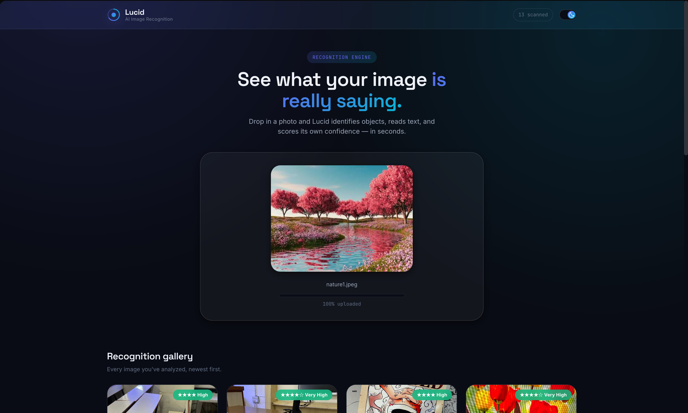

### 🖼️ Gallery


### 📊 Image Table (DynamoDB)

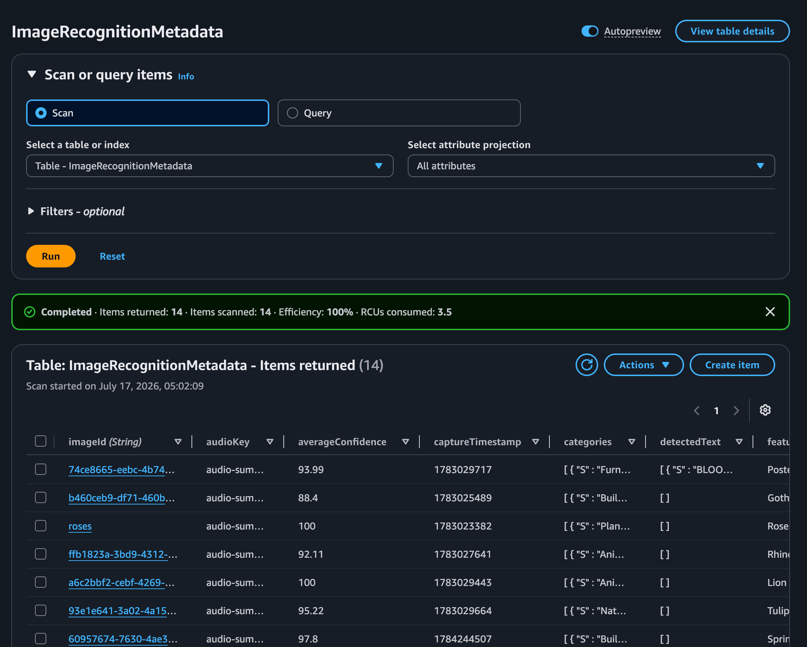

### 🔎 Image Modal — Objects

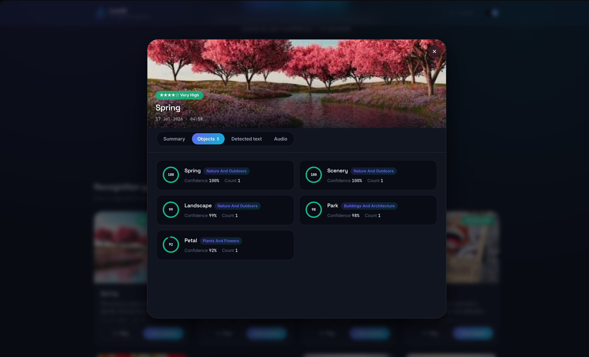

### 📝 Image Modal — Text Detection

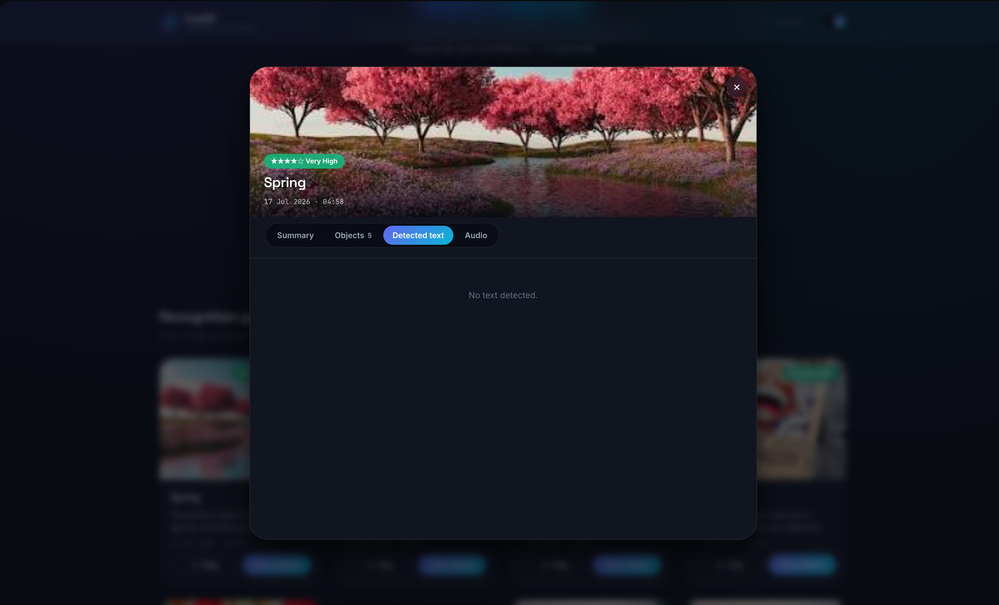

### 📄 Image Modal — Summary

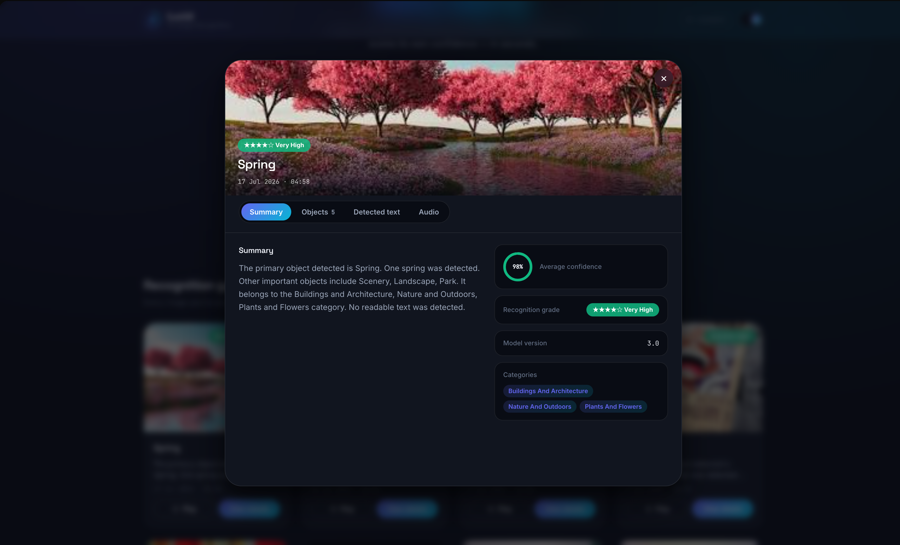

### 🔊 Image Modal — Audio

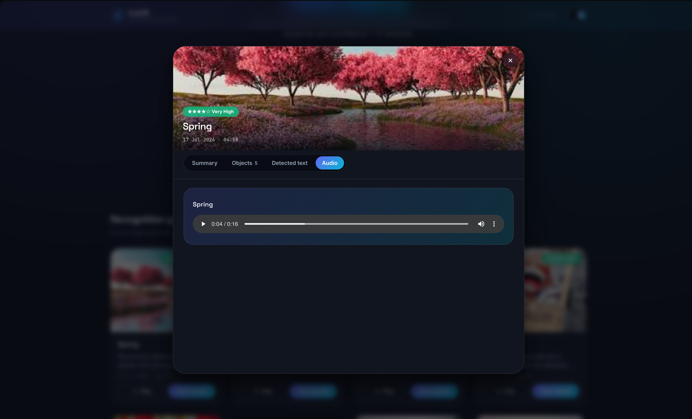

### 🪣 Hosting S3 Bucket

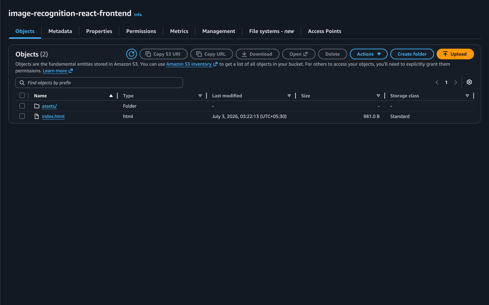

### 🗄️ Data S3 Bucket

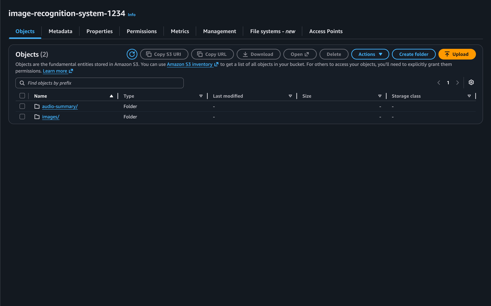

### 🎵 S3 Audio Summaries

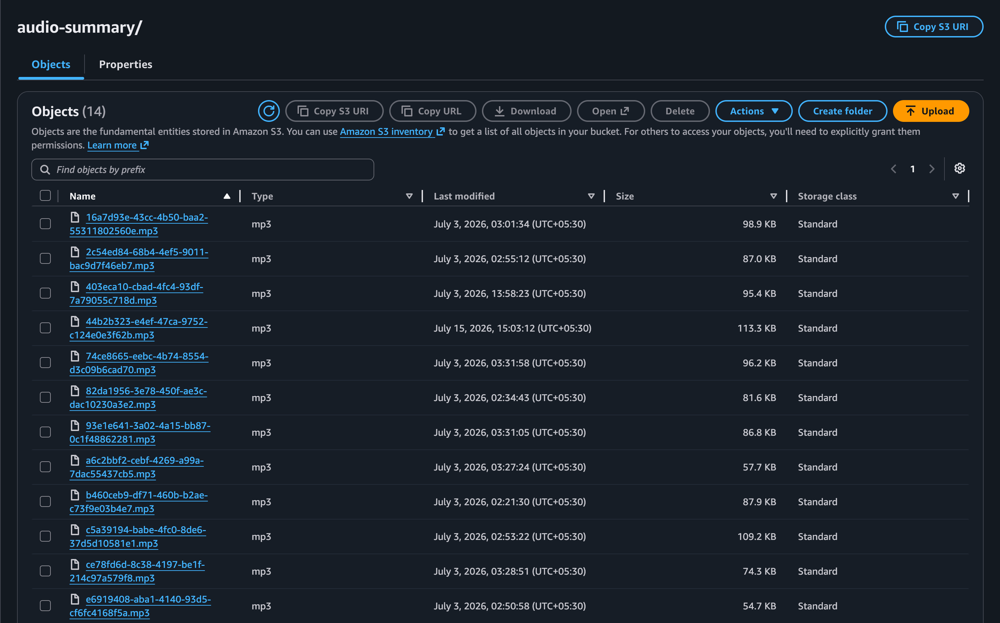

### 🖼️ S3 Images

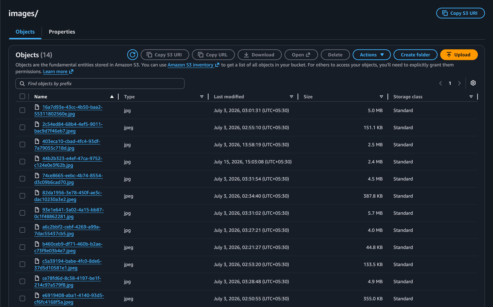

---

## 🔌 REST API Endpoints

Base URL: `https://hdr0ekq016.execute-api.ap-south-1.amazonaws.com`

| Method | Route | Lambda | Description |
|---|---|---|---|
| `POST` | `/upload-url` | `generate_upload_url` | Returns `imageId`, `objectKey`, and a pre-signed S3 PUT URL (5-minute expiry). Accepts `{ "extension": "jpg" \| "jpeg" \| "png" \| "webp" }`. |
| `GET` | `/images` | `image_dashboard_api` | Returns all image recognition records, sorted newest first. Each record includes a pre-signed image URL and audio URL (1-hour expiry). |
| `GET` | `/image/{id}` | `image_dashboard_api` | Returns the full detail record for a single image by `imageId`. Includes objects array, categories, detected text, summary, grade, and pre-signed URLs. |

All responses include CORS headers (`Access-Control-Allow-Origin: *`).

---

## 📁 Repository Structure

```
Image-Recognition/
├── index.html                      # Vite HTML entry point
├── vite.config.js                  # Vite build configuration
├── package.json                    # npm dependencies (React 19, Vite)
├── src/
│   ├── main.jsx                    # React entry point
│   ├── App.jsx                     # Root component — page composition
│   ├── index.css                   # Global styles and CSS custom properties
│   ├── App.css                     # App-level styles
│   ├── components/                 # Reusable UI components
│   │   │                           # (Navbar, UploadCard, Gallery, ImageCard,
│   │   │                           #  DetailsModal, ObjectCard, LoadingSpinner,
│   │   │                           #  Toast, Tabs, AudioPlayer, ConfidenceRing)
│   ├── hooks/                      # Custom React hooks (useTheme, useToast, useGallery)
│   ├── pages/                      # Page-level components
│   ├── services/
│   │   └── api.js                  # All backend API calls (no fetch outside this file)
│   └── utils/
│       └── format.js               # Date, confidence, and grade formatting helpers
├── lambda-functions/
│   ├── generate_upload_url.py      # Generates pre-signed S3 PUT URL
│   ├── image_processor.py          # S3-triggered; Rekognition + Polly + DynamoDB
│   └── image_dashboard_api.py      # Serves /images and /image/{id}
├── project_images/                 # Screenshots for documentation
├── dist/                           # Vite production build output
└── PROJECT_METADATA.md             # Project metadata
```

---

## 🛠️ Technology Stack

### Frontend

| Technology | Detail |
|---|---|
| React 19 | Functional components and hooks; no Redux, no Context API |
| Vite 6 | Development server and production bundler |
| Plain modern CSS | Custom properties, no CSS framework or UI kit |
| `fetch()` / `XMLHttpRequest` | All API calls; no AWS SDK, no Amplify |

### Backend

| Technology | Detail |
|---|---|
| Python 3 | All Lambda functions written in Python using `boto3` |
| AWS Lambda | Serverless compute for all backend logic |
| `boto3` | AWS SDK — S3, Rekognition, Polly, DynamoDB clients |

### AWS Infrastructure

| Service | Detail |
|---|---|
| Amazon S3 | Static hosting + image/audio storage |
| Amazon API Gateway | HTTP API |
| Amazon Rekognition | `detect_labels` + `detect_text` |
| Amazon Polly | `synthesize_speech` → MP3 |
| Amazon DynamoDB | `ImageRecognitionMetadata` table |
| Amazon IAM | Lambda execution roles |
| Amazon CloudWatch | Lambda logs |

---

## 🚀 Deployment

### Frontend

The React app is built with Vite (`npm run build`) and the contents of the `dist/` directory are uploaded to an **Amazon S3** bucket configured for static website hosting.

```bash
npm install
npm run build
# Upload dist/ to S3 static hosting bucket
```

### Backend

Lambda functions (`generate_upload_url.py`, `image_processor.py`, `image_dashboard_api.py`) are deployed individually to **AWS Lambda**. The `image_processor` function is connected to an S3 event notification on the `images/` prefix. All three are exposed via **Amazon API Gateway** (HTTP API).

---

## 🔁 CI/CD Pipeline

No CI/CD pipeline configuration file (`buildspec.yml` or equivalent) is present in this repository. Deployment is performed manually.

---

## 🎓 Learning Outcomes

- Building a serverless, event-driven image processing pipeline with S3, Lambda, Rekognition, Polly, and DynamoDB
- Generating and consuming pre-signed S3 URLs for secure direct browser uploads with upload progress tracking via `XMLHttpRequest`
- Using Amazon Rekognition `detect_labels` and `detect_text` to extract structured results from images
- Using Amazon Polly `synthesize_speech` to generate MP3 audio from programmatically constructed text summaries
- Designing DynamoDB data models for storing and retrieving multi-attribute recognition metadata
- Building a React 19 application with functional components, custom hooks, and no external state management libraries
- Implementing light/dark theme switching with `localStorage` persistence and OS preference detection
- Optimising gallery performance with lazy-loading images and memoized React components

---

## 🔮 Future Improvements

- Add a **Delete** button to remove images and their associated metadata from S3 and DynamoDB.
- Add secure login to restrict access to authorised users.

---

## 👤 Author

**Sarvesh**  
GitHub: [sarvesh871](https://github.com/sarvesh871)  
Repository: [Image-Recognition](https://github.com/sarvesh871/Image-Recognition)
